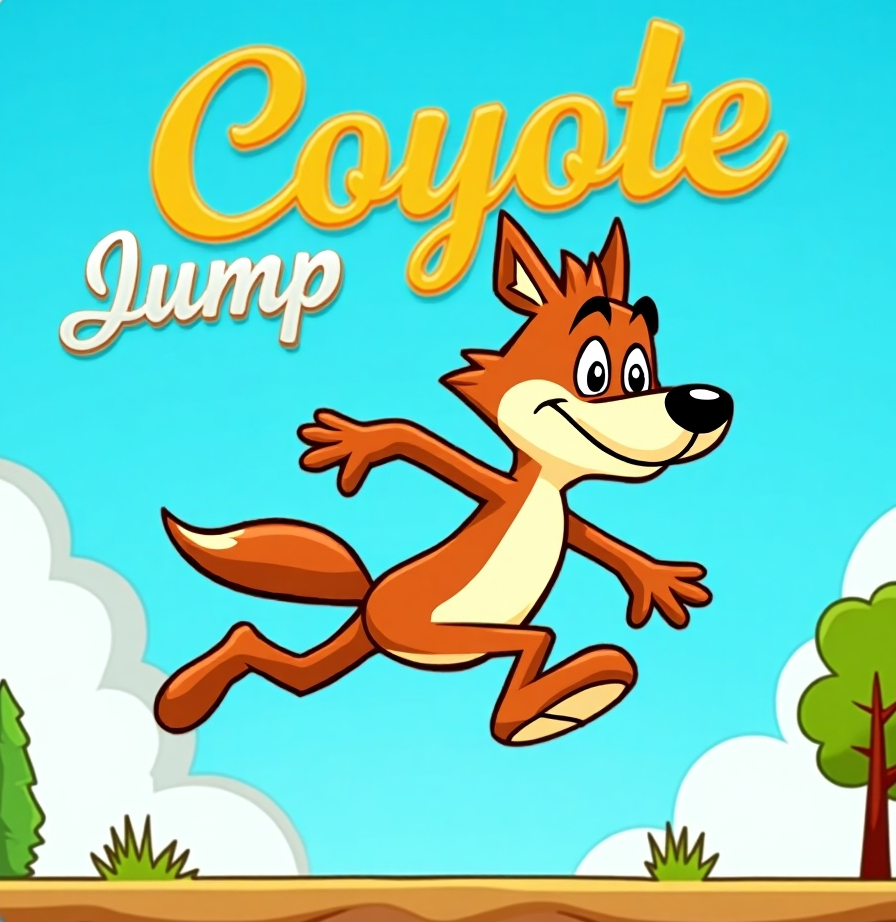

# 🦘 Coyote Jump – Godot 4.x Plugin

  

**Coyote Jump** is a plugin for the Godot 4.x engine that adds two essential features to any responsive 2D platformer:

- **Coyote Time**: allows the player to jump shortly after leaving a platform.
- **Jump Buffer**: queues a jump input pressed just before landing, preventing missed jumps.

Perfect for making platformers feel smooth, forgiving, and professional.

---

## 📦 Installation

1. Download or clone the plugin into your project directory:

## 🙌 Credits

Developed by [Mariano Damian Abadie].  
Inspired by classic platformer mechanics in _Celeste_, _Hollow Knight_, and _Super Meat Boy_.

---

## ❤️ Support This Project

If you find this plugin helpful and would like to support its development, consider donating:

👉 [Donate here](https://whydonate.com/es/donate/donaciones-por-proyectos)

Your support helps keep tools like this free and updated. Thank you!
